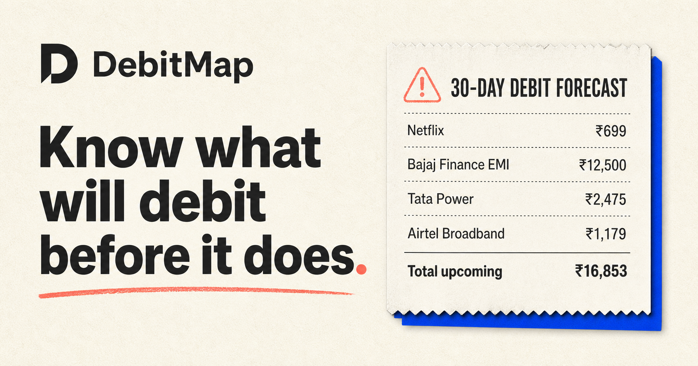

# DebitMap



DebitMap answers one question: **which recurring payments are likely to debit me in the next 30 days?**

It turns Indian bank and payment messages into an explainable commitment calendar. It detects subscriptions, UPI AutoPay, card payments, EMIs, insurance, utilities, NACH, and standing instructions when the messages contain enough evidence.

This repository contains:

- a public interactive judge demo
- a stateless Next.js API and a matching FastAPI service
- a Kotlin and Jetpack Compose Android app
- Room storage, SMS filtering, WorkManager scans, and notifications
- FinEE training and held-out evaluation scripts
- an explainable recurring-payment engine with user feedback

## What makes it different

Mandate managers show formal mandates. DebitMap looks at actual debit history. This can surface repeating card charges, variable utility bills, and other commitments that are not visible in one UPI mandate screen.

DebitMap does not cancel payments. It forecasts likely debits and shows the evidence behind every result.

## How it works

1. The Android app rejects OTPs and non-financial messages locally.
2. Likely financial messages go to a stateless parser. Raw text is not logged or stored.
3. Rules extract exact amounts, dates, direction, references, and account suffixes.
4. A small classifier trained on FinEE categorizes transaction descriptions.
5. The forecast engine groups normalized merchants and checks weekly, monthly, quarterly, and annual intervals.
6. Three consistent debits or explicit mandate language create a high-confidence prediction.
7. The app schedules an alert three days before high-confidence predicted debits.

## Run the web demo

Requires Node.js 22.13 or newer.

```bash
npm install
npm run dev
```

The web demo works without a backend. It uses the same parser and forecast rules in `lib/debitmap.ts`. The stateless endpoints are available at:

- `POST /api/v1/parse`
- `POST /api/v1/forecast`

Run checks with:

```bash
npm test
```

## Run the FastAPI service

```bash
python3 -m venv .venv
.venv/bin/pip install -r backend/requirements.txt
PYTHONPATH=backend .venv/bin/uvicorn app.main:app --reload
```

API documentation is exposed at `/docs`. Access logs are disabled in the deployment command so financial payloads cannot be written accidentally.

## Build Android

Open `android/` in Android Studio, or build from the command line:

```bash
cd android
./gradlew testDebugUnitTest assembleDebug \
  -PDEBITMAP_API_URL=https://your-deployment.example/api/
```

The APK requires Android 8 or newer. Google Play treats SMS access as restricted. SMS-based money management is an eligible exception, but publishing still requires a permissions declaration and review. The prototype is distributed as a direct APK.

## Dataset and measured results

The primary dataset is [FinEE](https://huggingface.co/datasets/Ranjit0034/finee-dataset), released under Apache 2.0. It contains more than 152,000 Indian financial messages across English, Hindi, Tamil, Telugu, Bengali, and Kannada. Most records are synthetic.

The included lightweight category model was trained on 7,157 labeled records from FinEE's validation split and measured on 7,108 categorized records from its separate test split.

| Measurement | Result |
| --- | ---: |
| Category accuracy | 92.16% |
| Amount exact match against FinEE labels | 87.53% |
| Debit or credit accuracy | 91.32% |

The amount result is below the planned 95% target. Manual inspection found many FinEE messages where the text says `Rs.33036` but the label says `33036.31`. DebitMap extracts the amount present in the message and reports the lower label-based score instead of adjusting the metric. See [MODEL_CARD.md](MODEL_CARD.md) and [evaluation/results.json](evaluation/results.json).

These metrics are not production accuracy claims.

## Privacy boundary

- no account or sign-in
- no advertising or analytics SDK
- no server database
- no raw SMS in API responses or logs
- normalized transactions stay in the Android Room database
- user feedback stays on the device
- the web demo clears imported data when the tab closes

Read [PRIVACY.md](PRIVACY.md) before testing with personal messages.

## Current limitations

- A commitment needs at least two historical debits unless the message explicitly describes a mandate.
- New mandates without a confirmation message cannot be detected.
- Merchant aliases are incomplete.
- Real-device SMS behavior has not been verified. The complete flow was tested on an Android 15 emulator.
- The APK is debug-signed and intended for judging, not production distribution.
- The model is trained mostly on synthetic data.

## License

Apache 2.0. See [LICENSE](LICENSE).

